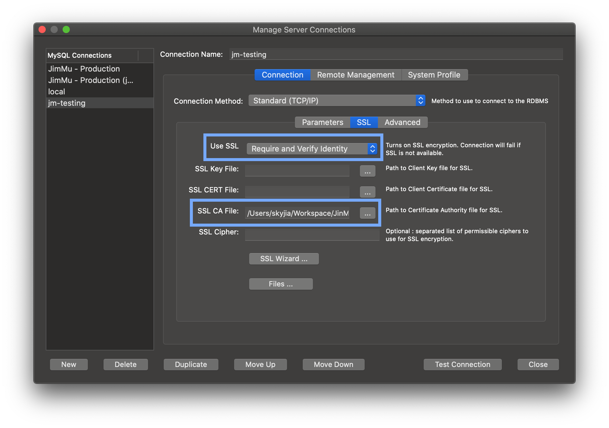

# 使用 TLS 安全连接方式访问 AWS RDS MySQL

### 1证书

证书文件位置：

```sh
└── cn-north-1
    ├── rds-ca-2019-cn-north-1.pem			#中间证书
    ├── rds-cn-ca-2019-root.pem					#CA根证书
    └── rds-combined-ca-cn-bundle.pem		#绑定的证书链
```

参考文档：https://docs.amazonaws.cn/AmazonRDS/latest/UserGuide/USER_ConnectToInstance.html

### 2 命令行方式访问

`mysql` 命令使用 `--ssl-ca` 参数指定CA根证书文件，并设定 `--ssl-mode=VERIFY_IDENTITY`。

**示例：**

```sh
# 使用CA根证书进行安全的访问
mysql \
  -h jinmu-test.cjzrjn31gtsw.rds.cn-north-1.amazonaws.com.cn \
  --port=63306 \
  --user=jmtest \
  --ssl-ca=cn-north-1/rds-cn-ca-2019-root.pem \
  --ssl-mode=VERIFY_IDENTITY \
  -p
```

### 2 MySQL Workbench 方式访问

MySQL Workbench 中设定连接的 SSL 参数：

- 设定 **Use SSL** 参数为 `Require and Verify Identity`
- 设定 **SSL CA File** 为CA根证书文件路径

